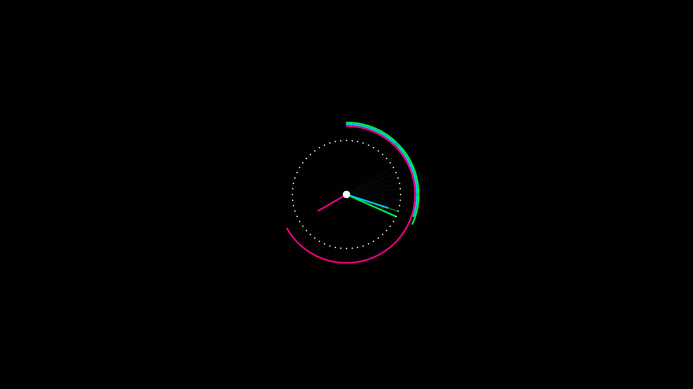

# Clock Works

A collection of clock programmes that I've written to *pass time.*

#### Banner Clock (p5.js)

#### Trail Clock (p5.js)

#### Analog Clock (Vanilla JS)

#### Matrix Clock (p5.js)*

> 95% of the code is from [Emily Xie's Green Rain Project](https://github.com/emilyxxie/green_rain.git).
> 
> Font used for the watch is [Gang of Three](https://www.dafont.com/gang-of-three.font) by Vic Fieger.